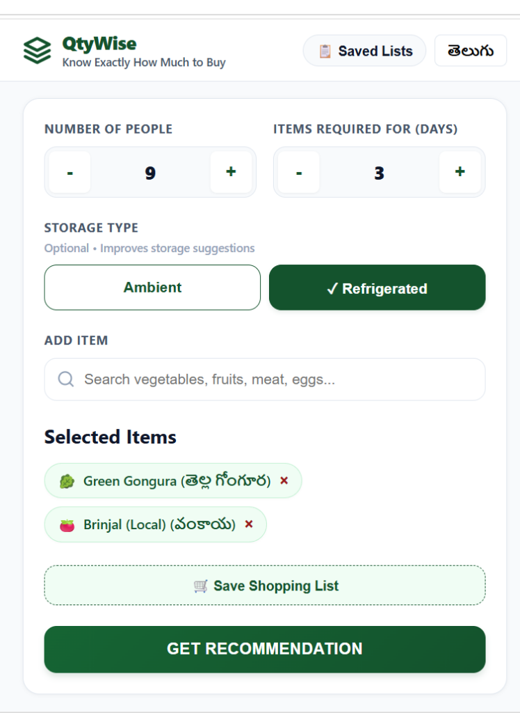
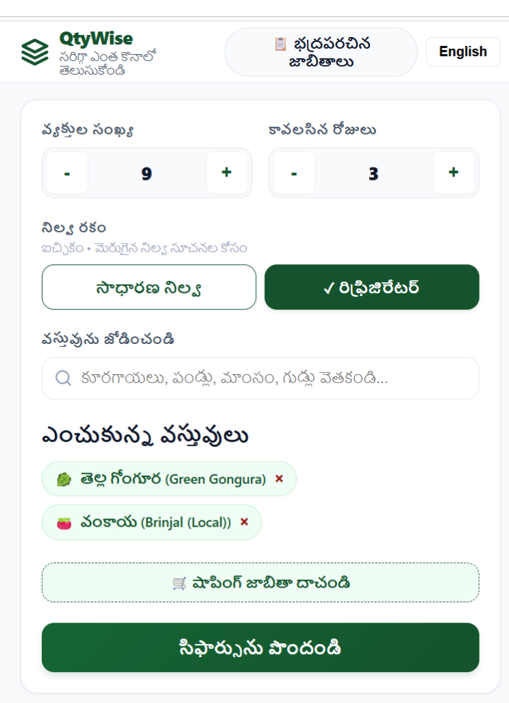
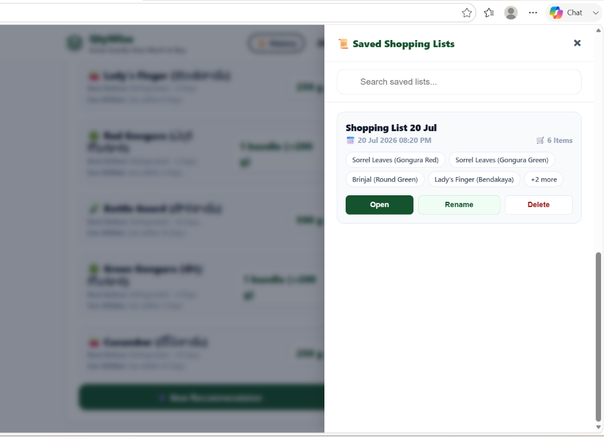

# QtyWise — Smart Purchase Quantity Advisory Utility

[](https://qty-wise.vercel.app/)
[](#)
[](#)
[](#)
[](#)

QtyWise is a smart, mobile-first purchase quantity advisory utility designed for households and community kitchens in Andhra Pradesh. It calculates the exact raw quantity of vegetables, leafy greens, meat, fish, seafood, herbs, and eggs to purchase based on portion requirements, duration (days), and refrigerator storage preferences — minimizing food waste and optimizing grocery budgets.

---

## 📌 Project Overview

Many households struggle with accurately estimating grocery purchase quantities, leading to either food spoilage or shortage. QtyWise solves this by providing precise portion calculations based on regional consumption data.

*   **Problem**: Over-purchasing perishable items leads to food waste, while under-purchasing causes inconvenience.
*   **Solution**: QtyWise uses standardized per-person consumption formulas and market yield factors to recommend real-world purchase quantities.

> [!IMPORTANT]
> **Functional Scope**: QtyWise is a portion size calculator and shopping list manager. It is **NOT** an e-commerce platform and does **NOT** provide food recipes.

---

## ✨ Key Features

*   **🧮 Smart Portion Recommendation**: Calculates exact quantities using regional portion formulas (per person per day).
*   **🛍️ Real-World Market Units**: Displays quantities in traditional Indian purchase units (`Bunches/Bundles`, `Packets`, `Eggs`, `Pieces`, `g`, `kg`).
*   **🔢 Editable Stepper Inputs**: Direct numeric typing for **Number of People** (1–100) and **Items Required For** (1–30 Days) alongside `+` / `−` buttons.
*   **📋 Saved Shopping Lists & History**: Save, search, rename, open, and delete custom shopping lists stored in Local Storage (`qtywise_saved_lists_v1`).
*   **🌐 Dynamic Bilingual UI**: Instant English $\leftrightarrow$ Telugu language toggle (`Green Gongura (తెల్ల గోంగూర)` / `తెల్ల గోంగూర (Green Gongura)`).
*   **⚡ 100% Offline Capability**: Full calculation engine fallback available in client-side JavaScript when disconnected.
*   **📱 Mobile-First Responsive Design**: Optimized for touch targets ($\ge 44 \times 44\text{px}$) across viewports from 320px to 4K.

---

## 📂 Repository Structure

```
QtyWise
│
├── frontend                        # Responsive Web Client Interface (HTML5, Vanilla CSS3, ES6 JS)
│   ├── app.js                      # SPA State Manager & API Client
│   ├── index.css                   # Custom CSS Design System
│   └── index.html                  # Semantic Web App Layout
├── backend                         # Node.js & Express REST API Service
│   ├── config/                     # Environment & Path Configuration
│   ├── controllers/                # API Request Controllers
│   ├── middleware/                 # Validators & Error Handlers
│   ├── routes/                     # API Endpoints Router
│   ├── services/                   # Normalizer & Portion Engines
│   └── utils/                      # Synchronous CSV Parsers
├── dataset                         # Production Master Data Catalog
│   ├── categories.json             # Two-Tier Category Definitions
│   └── ap_master_dataset_v1.0.csv  # 119 Production Master Items (AP Region)
├── screenshots                     # Application Interface Previews
├── docs                            # Architectural & Design Blueprints
├── README.md                       # Repository Documentation
├── LICENSE                         # MIT Open Source License
└── .gitignore                      # Git Ignored Build Assets & Environments
```

---

## 🛠️ Tech Stack

*   **Frontend**: HTML5, Vanilla CSS3 (CSS Variables, Flexbox/Grid), ES6 JavaScript (Native SPA State Management).
*   **Backend**: Node.js (v18+), Express.js, CORS, Morgan Logger, Dotenv.
*   **Master Dataset**: CSV / JSON in-memory dataset engine with integer-gram normalization on startup.

---

## ⚙️ Installation & Setup Guide

### Prerequisites
*   Node.js (v18.0.0 or higher)
*   npm (v9.0.0 or higher)

### 1. Clone Repository
```bash
git clone https://github.com/uTharun23/QtyWise.git
cd QtyWise
```

### 2. Backend Setup
```bash
cd backend
npm install
npm run dev
```
*Backend server will start at `http://localhost:5001`.*

### 3. Frontend Setup
Open a new terminal and serve the static frontend:
```bash
cd frontend
npx serve ./ -p 3000
```
*Access QtyWise in your browser at `http://localhost:3000`.*

---

## 🖼️ Application Interface Previews

| 1. English Mode UI | 2. Telugu Mode UI | 3. Saved Lists Drawer |
| :---: | :---: | :---: |
|  |  |  |
| *Editable Stepper Inputs & English Mode* | *Full Bilingual Telugu UI Layout* | *Saved Shopping Lists Side Panel* |

---

## 🚀 Future Scope

*   **📲 WhatsApp Sharing**: One-click sharing of calculated shopping lists via WhatsApp.
*   **💰 Estimated Price Calculator**: Integration with live market Mandi rates for grocery budget estimates.
*   **🍲 Recipe Portion Scaling**: Calculate grocery needs based on specific dish menus (e.g. Biryani for 50 people).
*   **🗺️ Multi-State Expansion**: Expand master datasets to Telangana, Tamil Nadu, and Karnataka regional diets.

---

## 🌐 Live Demo & Endpoints

*   🚀 **Live Web Application**: [https://qty-wise.vercel.app/](https://qty-wise.vercel.app/)
*   💚 **Live Health API**: [https://qty-wise.vercel.app/health](https://qty-wise.vercel.app/health)
*   📦 **Live Catalog API**: [https://qty-wise.vercel.app/api/items](https://qty-wise.vercel.app/api/items)
*   🐙 **GitHub Repository**: [https://github.com/uTharun23/QtyWise](https://github.com/uTharun23/QtyWise)

---

## 👤 Author

*   **Tharun**
*   **GitHub**: [@uTharun23](https://github.com/uTharun23)
*   **Project**: [QtyWise Repository](https://github.com/uTharun23/QtyWise)

---

## 📄 License

This project is licensed under the [MIT License](LICENSE).
