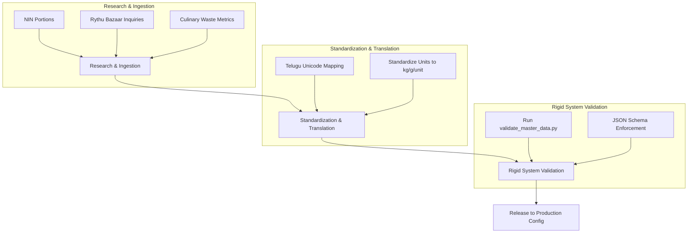

# QtyWise (Working Title) — Project Foundation & Master Data Collection Strategy
**Author:** Senior Solution & Product Architect, Lead Data Architect  
**Version:** 1.0 (Andhra Pradesh Focus)  
**Status:** Approved for Engineering Review  

---

## 1. Project Vision

The vision of **QtyWise** is to design and deploy a simple, lightning-fast, mobile-first web utility that empowers households and community cooks in Andhra Pradesh to determine the exact quantities of raw ingredients (vegetables, leafy vegetables, root vegetables, meat, fish, seafood, eggs, and herbs) to purchase. 

By mapping localized consumption averages, seasonal availability, and household demographics, QtyWise eliminates the guesswork from grocery shopping. The platform is intentionally scoped as a **pure quantity advisory utility**—it does not offer e-commerce, recipe directories, or grocery delivery. Its singular target is to give users a precise, waste-reducing buying quantity list in seconds.

---

## 2. Problem Statement

Household grocery procurement in Andhra Pradesh is highly inefficient, plagued by three distinct issues:
1.  **Over-Purchasing and Food Waste**: Consumers purchase excess quantities due to a lack of planning tools, leading to high spoilage rates of perishable goods (especially delicate leafy greens like *Gongura* and *Thotakura*) in ambient tropical conditions.
2.  **Under-Purchasing and Meal Disruption**: Inaccurate estimations lead to mid-week shortages, requiring emergency trips to local markets or altering meal menus.
3.  **Procurement Complexity**: Standard cooking guidelines do not translate easily into raw weight metrics. For example, estimating how many grams of *Vankaya* (Brinjal) are needed to feed 6 adults for 3 days requires complex calculations involving waste margins, shrinkage, and serving portions.

---

## 3. Business Goals

| Goal ID | Business Goal | Metric / Target | Architectural Support |
| :--- | :--- | :--- | :--- |
| **BG-01** | **Minimize Domestic Waste** | Target a 25% reduction in reported vegetable spoilage among active users within 6 months. | Accurate calculation algorithms based on storage type (ambient vs. refrigerated). |
| **BG-02** | **Optimize Grocery Budgets** | Help households save up to 15% on fresh produce costs by avoiding excess buying. | Precise recommendation engine scaling to decimal fractions of a kilogram. |
| **BG-03** | **Maximize User Engagement** | Achieve a weekly active user (WAU) retention rate of >40% for the core shopping tool. | Fast load times, zero login barriers, and high mobile usability. |
| **BG-04** | **Establish Data Foundation** | Build a validated regional food consumption database for future commercial APIs. | Strict schema enforcement and normalized data curation. |

---

## 4. Target Audience

QtyWise separates its target audience into two distinct tiers:

### 4.1 Primary Users (Domestic Household Units)
*   **Families (Nuclear and Joint)**: Standard households managing multi-person meals with varying dietary preferences.
*   **Bachelors and Students**: Shared accommodation units cooking in small, variable groups with minimal storage infrastructure.
*   **Working Professionals**: Time-constrained individuals who procure groceries on a strict weekly cycle.

### 4.2 Secondary Users (Event & Micro-Community Units)
*   **Small Functions / Birthday Parties**: Households hosting events (10–30 people) needing raw material guidance without commercial catering services.
*   **Guests / Relatives Hosting**: Temporary household expansion requiring immediate adjustments to standard consumption metrics.
*   **Small Community Kitchens**: Local temple or community gathers preparing weekend food (*Prasadam* or shared meals).

---

## 5. User Personas

### Persona A: Sravani (34, Working Mother, Vijayawada)
*   **Context**: Manages a household of 4 (herself, husband, 2 kids) plus visiting parents.
*   **Shopping Pattern**: Once-a-week trip to the local Rythu Bazaar on Sunday morning.
*   **Storage**: Double-door refrigerator available.
*   **Goal**: Wants to purchase exactly enough leafy vegetables and gourds so nothing spoils by Friday, while ensuring she doesn't run out of staples like onions and tomatoes.

### Persona B: Tharun (23, Software Engineer, Visakhapatnam)
*   **Context**: Shares a rented apartment with 3 flatmates.
*   **Shopping Pattern**: Ad-hoc purchases from local street vendors after office hours.
*   **Storage**: No refrigerator; relies purely on ambient storage in a warm, humid coastal environment.
*   **Goal**: Needs small, precise quantities of vegetables (e.g., 200g of okra, 100g of green chillies) to avoid storage rot and save money.

### Persona C: Satyanarayana (52, Temple Committee Member, Nellore)
*   **Context**: Organizes small community lunches (20-25 devotees) on festival days.
*   **Shopping Pattern**: Wholesale market procurement.
*   **Storage**: Ambient storage for less than 24 hours.
*   **Goal**: Needs to estimate bulk requirements for mutton, local fish, and root vegetables to prepare the feast without running short or wasting expensive items.

---

## 6. User Problems

*   **Waste in Storage**: Inability to estimate shelf-life based on local temperature variations. Leafy greens turn yellow and slimy within 24 hours at room temperature in Andhra.
*   **Pack Size Mismatch**: Local markets sell in specific minimum bundles (e.g., *kattalu* for leafy greens). Users do not know how many bundles translate to their actual consumption.
*   **Sizing Inconsistency**: One "Brinjal" or "Bottle Gourd" varies significantly in weight. Recipes are written in numbers of items, but markets sell by weight (kilograms).
*   **Varying Family Scales**: Inability to quickly compute proportions when family size changes from 2 to 8 people.

---

## 7. Product Objectives

*   **Instant Recommendations**: Deliver quantity recommendations in under 3 clicks on a mobile browser.
*   **Zero Authentication Friction**: Allow immediate usage without username, password, email verification, or phone numbers.
*   **Zero Data Footprint**: Preserve user configurations (number of people, storage setup) entirely client-side using `localStorage`.
*   **High Mathematical Precision**: Scale calculations based on localized daily consumption metrics adjusted for age and activity multipliers.

---

## 8. Functional Scope (Version 1)

*   **Quantity Calculation Engine**: Computes target shopping lists based on User Input (People Count, Duration in Days, Storage Type).
*   **Category Filter Interface**: Quick navigation tabs for Vegetables, Leafy Vegetables, Root Vegetables, Meat, Fish, Seafood, Eggs, and Herbs.
*   **Regional Language Toggle**: Direct UI transition between English and Telugu vernacular terminologies.
*   **Storage Modifiers**: Dynamic shelf-life alerts and quantity scaling when the user selects "Ambient" instead of "Refrigerated".
*   **Interactive Shopping List View**: A checkable, shareable plain-text summary of calculated quantities for copy-pasting to SMS/WhatsApp.

---

## 9. Non-Functional Scope (Version 1)

*   **Performance (Speed)**: Time to Interactive (TTI) must be under **1.0 second** on a standard 3G mobile connection. Initial bundle size must be under **150 KB**.
*   **Mobile-First Layout**: Fully responsive layout optimized for screens between 320px and 480px width.
*   **Accessibility**: High color contrast (AAA standard) for readability in bright sunlight (outdoor market usage).
*   **Offline Capability**: Service-worker caching of master data to allow quantity recalculations inside poor-coverage market areas.

---

## 10. Project Assumptions

1.  **Consumption Stability**: Average dietary consumption patterns in Andhra Pradesh remain relatively stable month-to-month, with fluctuations driven primarily by seasonal availability, not changes in portion sizes.
2.  **Standard Waste Profiles**: Commercial food preparation waste margins (e.g., skin peeling, seed removal, bone extraction) remain constant across households.
3.  **Local Market Availability**: The local retail system (Rythu Bazaars, push-cart vendors) sells by weight in increments of 50g, 100g, 250g, 500g, and 1kg.

---

## 11. Product Constraints

1.  **Browser Compatibility**: Must function correctly on legacy WebView engines used in budget Android smartphones (common in rural AP).
2.  **No Server-Side Compute**: Calculations must execute entirely on the client-side browser to minimize server costs and ensure infinite scalability.
3.  **Static Master Data**: Version 1 will compile master food data directly into the client bundle; real-time database queries are prohibited.

---

## 12. Business Rules

*   **BR-01 (Minimum Buying Limit)**: Calculated recommendations must never be lower than the item’s defined `min_quantity` (e.g., if calculation yields 30g of green chillies, recommend the market minimum of 100g).
*   **BR-02 (Ambient Storage Ceiling)**: If storage type is "Ambient", the duration parameter is capped at the minimum shelf life of the selected items (e.g., do not recommend buying leafy greens for a 7-day duration if ambient shelf life is 1 day).
*   **BR-03 (Measurement Unit Standards)**: Weight must always be output in kilograms (`kg`) for values $\ge 1.0\text{kg}$ and grams (`g`) for values $< 1.0\text{kg}$. Eggs must always be calculated as whole integers (`unit`).

---

## 13. Version 1 Boundaries

To preserve architectural focus and speed up time-to-market, the following constraints are placed on the initial release:

```
┌─────────────────────────────────────────────────────────┐
│                    QtyWise V1 Scope                     │
├────────────────────────────┬────────────────────────────┤
│         IN SCOPE           │        OUT OF SCOPE        │
├────────────────────────────┼────────────────────────────┤
│ • Vegetables & Herbs       │ • User Accounts & Logins   │
│ • Local AP Meats & Fish    │ • Meal/Recipe Suggestions  │
│ • Ambient/Fridge Adjust    │ • Prices & Budget Tracking │
│ • English & Telugu UI      │ • Offline Database Sync    │
│ • Static JSON Engine       │ • Push Notifications       │
└────────────────────────────┴────────────────────────────┘
```

---

## 14. Future Roadmap

1.  **Phase 2 (Telangana Expansion)**: Localize terminology (e.g., *Gangabayala Kura*) and consumption coefficients for Hyderabad and Telangana districts.
2.  **Phase 3 (Grains & Dry Staples)**: Introduce inventory calculations for monthly staple restocking (Rice, Atta, Oils, Dals, Spices).
3.  **Phase 4 (Personalization Engine)**: Add configuration options for age distribution (kids vs. adults) and dietary preferences (high-protein, pure vegetarian, keto profiles).

---

## 15. Risks

| Risk ID | Risk Description | Severity | Mitigation Strategy |
| :--- | :--- | :--- | :--- |
| **RK-01** | **Accuracy Discrepancy**: Standard calculations do not fit specific heavy-eating households. | High | Provide a clear disclaimer in the UI. Allow users to adjust a simple scaling multiplier (+20%, -20%) in settings. |
| **RK-02** | **Extreme Market Seasonality**: Crops completely vanish or change size during floods/summers. | Medium | Use dynamic seasonal flags in the master dataset to block or warn users during specific months. |
| **RK-03** | **Connectivity Rot**: App fails in deep concrete basement markets. | High | Compile data into a static configuration JSON; use PWA Service Worker to cache the application shell. |

---

## 16. Success Metrics

*   **P95 Load Time**: $\le 600\text{ms}$ on typical mobile browser test setups.
*   **Recalculation Count**: Active users triggering recalculations $\ge 3$ times per session, proving active use during market tours.
*   **List Export Action**: $> 30\%$ of users using the "Copy List" or "Share on WhatsApp" function.

---

## 17. Data Collection Strategy

Master data is collected using a three-phase ingestion cycle:



*   **Step 1: Raw Collection**: Field agents gather crop varieties and vernacular terms across Vijayawada, Nellore, and Kadapa markets.
*   **Step 2: Database Harmonization**: Clean strings, resolve synonyms (e.g., mapping *Anapakaya* and *Sorakaya* to the same database record), and apply standard yield fractions.
*   **Step 3: Verification**: Cross-verify standard portion sizes with historical nutrition logs from agricultural universities.

---

## 18. Data Quality Strategy

1.  **Single Source of Truth**: All configuration calculations derive from `ap_master_dataset_v1.0.csv`. Hardcoded item arrays inside components are strictly prohibited.
2.  **No Placeholders Allowed**: Every cell in the master CSV must contain valid, non-null values. If an item cannot be frozen, `shelf_life_days_frozen` must register `NULL` explicitly.
3.  **Synonym Registries**: Keep a dictionary of regional synonyms to map user searches to standardized English names.

---

## 19. Validation Strategy

Validation occurs at compile-time and runtime.

### 19.1 Ingestion Validation
*   No duplicates allowed in `item_id`, `english_name`, or `telugu_name`.
*   Uniqueness verified by executing a localized casing lookup:
    $$\text{LowerStrip}(Name) = \text{lowercase}(\text{trim}(Name))$$

### 19.2 Relational Validation Schema
All inputs must conform to the JSON schema validation spec at `database/schemas/validation_schema.json`.

---

## 20. Documentation Standards

*   **Versioning**: All changes to the database structure or planning sheets must increment semantic versions (e.g. `v1.0.0` to `v1.0.1`).
*   **Markdown Preservation**: Keep comments, mathematical formulations, and tables intact.
*   **No Code Injection**: Do not write application scripts or controller code inside documentation files.

---

## 21. Folder Structure

We organize data assets, configurations, and specs in the project's codebase as follows:

```
QtyWise/
├── docs/
│   ├── 01-Project-Blueprint.md         # This comprehensive master plan
│   ├── 02-Requirements.md              # Functional specifications
│   ├── 03-System-Architecture.md       # Topology and service layouts
│   ├── 04-Database-Design.md           # Entity relationship models
│   ├── 05-Recommendation-Engine.md     # Formulas and scaling variables
│   └── 11-Master-Data-Framework.md     # Ingestion & cleaning strategy
├── database/
│   ├── schemas/
│   │   ├── postgres_master_schema.sql  # Database DDL structure
│   │   └── validation_schema.json      # Ingestion testing configuration
│   └── master_data/
│       ├── categories.json             # Item categorization mapping
│       └── ap_master_dataset_v1.0.csv  # Production dataset template
└── README.md                           # Main developers landing page
```

---

## 22. Naming Standards

*   **Standard ID Prefix**: `QTY-AP-` followed by a three-letter category code and four-digit sequence ID (e.g., `QTY-AP-VEG-0001`).
*   **Filename Format**: Lowercase separated by underscores for scripts (e.g., `validate_master_data.py`) and kebab-case for documentation files (e.g., `01-project-blueprint.md`).

---

## 23. Deliverables

1.  **Comprehensive Architecture Blueprint** (This document).
2.  **Master Category JSON Registry** mapping valid sub-categories.
3.  **Master Dataset CSV File** containing initial validated items with consumption rates.
4.  **SQL DDL Schemas** containing constraint assertions.
5.  **JSON Validation Schemas** for the ingestion pipelines.

---

## 24. Final Project Summary

**QtyWise** represents a highly scoped, laser-focused utility aimed at solving a common daily friction point for millions of consumers in Andhra Pradesh. By resisting the temptation to add recipe books, budget tracking, or social networking, the product guarantees a clean, lightweight, and fast experience. 

The architecture established in this foundation enforces high data quality, strict validation constraints, and standardized categories, ensuring that when development starts, the engineering team has a clear, robust, and production-ready database framework.
