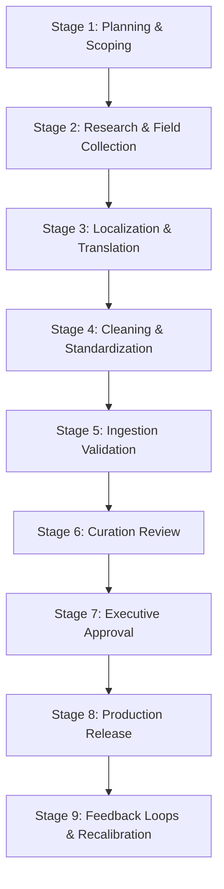

# QtyWise Master Data Collection Strategy

**Document Version:** 1.0.0-AP  
**Target Region:** Andhra Pradesh (Coastal Andhra, Rayalaseema, Uttarandhra)  
**Document Status:** Production-Ready Strategy  
**Intended Audience:** Data Curation Leads, Field Researchers, Agricultural Specialists, Database Designers, Project Managers

---

## 1. Introduction & Strategic Vision

This document defines the **Master Data Collection Strategy** for QtyWise V1 (Andhra Pradesh). The primary objective of QtyWise is to provide users with accurate purchase quantity recommendations for fresh produce, meats, seafood, eggs, and herbs. 

Because QtyWise operates as a pure decision support tool without real-time inventory tracking or e-commerce feedback loops, the accuracy of its recommendations depends entirely on the quality of its static master dataset. Under-estimating portion sizes leads to household meal shortages; over-estimating portion sizes leads to food waste and excess household expenditures. 

This strategy establishes a systematic framework for:
1.  Identifying reliable agricultural and dietary data sources in Andhra Pradesh.
2.  Executing a multi-stage field research and data localization workflow.
3.  Applying data quality gates to validate, standardize, and approve entries.
4.  Governing long-term dataset maintenance and seasonal updates.

---

## 2. Data Governance & Role Assignments

To ensure accountability and maintain documentation standards, data operations are managed under a strict governance hierarchy.

```
                  ┌──────────────────────────────┐
                  │      Data Curation Lead      │
                  │  (Final Approval & Release)  │
                  └──────────────┬───────────────┘
                                 │
         ┌───────────────────────┼───────────────────────┐
         ▼                       ▼                       ▼
┌──────────────────┐   ┌──────────────────┐    ┌──────────────────┐
│ Field Researchers│   │Language Localizers│   │   QA Inspectors  │
│(Bazaars/Portions)│   │ (Vernacular/Dishes)│  │(CI & Schema Rules)│
└──────────────────┘   └──────────────────┘    └──────────────────┘
```

*   **Data Curation Lead (DCL)**:
    *   *Responsibility*: Holds ultimate ownership of the master CSV and categories registries. Approves version upgrades and registers release tags.
    *   *Sign-off Role*: Executes the final manual review of the dataset before compilation.
*   **Field Researchers (FR)**:
    *   *Responsibility*: Conduct field audits at Rythu Bazaars, gather wholesale/retail pack increments, measure average weights of discrete food items, and log prep yield behaviors.
*   **Language Localizers (LL)**:
    *   *Responsibility*: Map standardized English names to correct Telugu Unicode scripts. Gather regional vernacular synonyms across Coastal, Rayalaseema, and Uttarandhra districts.
*   **Quality Assurance Inspectors (QAI)**:
    *   *Responsibility*: Maintain data compilation scripts and validate the structure of commits against the JSON Schema definition.

---

## 3. Data Collection Workflow

This workflow tracks the lifecycle of a food item record from initial identification to production release.



### Stage 1: Planning & Scoping
*   **Objective**: Define the target food list to be added or revised.
*   **Activities**:
    *   Identify high-priority crops based on Andhra market surveys.
    *   Classify target items into one of the 8 core categories (`VEG`, `LVE`, `RVE`, `MEA`, `FIS`, `SAF`, `EGG`, `HRB`).
    *   Establish regional boundary limits (e.g., scoping the research to specific districts in Rayalaseema vs. Coastal zones).

### Stage 2: Research & Field Collection
*   **Objective**: Collect raw portion sizes, edible yield ratios, and retail market packaging limits.
*   **Activities**:
    *   Conduct physical measurement sessions at local markets to record package weight standards (e.g., standard coriander bunch weights, green chilli retail bags).
    *   Extract baseline portion indices from dietary reference works.
    *   Measure prep waste fractions (discarding skin, stalks, bones) to calculate raw yield coefficients.

### Stage 3: Localization & Translation
*   **Objective**: Localize the record for vernacular Telugu speakers.
*   **Activities**:
    *   Map standard Telugu characters to the standard name.
    *   Record regional naming variants (synonyms) by interviewing market vendors in different sub-regions (e.g., identifying when an item name transitions from Coastal AP terminology to Rayalaseema vocabulary).
    *   Document the names of typical Andhra dishes in which the food is used.

### Stage 4: Cleaning & Standardization
*   **Objective**: Format raw inputs to match system standards.
*   **Activities**:
    *   Convert all weights (pounds, local bundles, fractions of kilograms) into integer grams (`g`).
    *   Apply title-casing to English text fields.
    *   Format JSON structures for storage rules, seasonality factors, and regional multipliers.

### Stage 5: Ingestion Validation
*   **Objective**: Automate data integrity checks.
*   **Activities**:
    *   Run linting scripts to verify CSV formatting.
    *   Verify data against the schema registry using JSON validation checks.
    *   Assert mathematical relationships (e.g., checking that minimum purchase values do not exceed standard weekly portion limits).

### Stage 6: Curation Review & Peer Review
*   **Objective**: Perform manual and comparative validation.
*   **Activities**:
    *   Present validation logs and comparative charts to the review board.
    *   Verify that portion estimates align with historical culinary guidelines for Andhra Pradesh households.
    *   Review regional multiplier weights for culinary accuracy.

### Stage 7: Executive Approval & Sign-off
*   **Objective**: Verify the release build.
*   **Activities**:
    *   The Data Curation Lead reviews the changelog.
    *   Verify that translations are complete and verified.
    *   Sign off on the data patch branch for production integration.

### Stage 8: Production Release
*   **Objective**: Update the production client bundle.
*   **Activities**:
    *   Compile the master CSV and categories JSON registry into a single client JSON file.
    *   Deploy the bundle via standard version controls.
    *   Execute client-side smoke tests.

### Stage 9: Feedback Loops & Recalibration
*   **Objective**: Maintain and update portion estimates over time.
*   **Activities**:
    *   Track user overrides of recommended purchase quantities in setting panels.
    *   Schedule quarterly reviews to adjust baseline coefficients based on collected metrics.

---

## 4. Data Sourcing Guidelines

To ensure the reliability of the dataset, researchers must prioritize verified scientific literature and agricultural statistics.

### 4.1 Classification of Data Sources

#### Primary Sources (Direct Field Research)
1.  **Rythu Bazaar Direct Surveys**: Local government-regulated farmers' markets in Vijayawada, Guntur, Nellore, Tirupati, and Visakhapatnam. Used for determining retail minimum weights, packaging increments, and regional synonyms.
2.  **Kitchen Yield Portions Audits**: Direct measurements of raw-to-cooked conversions and kitchen preparation waste factors carried out by local culinary partners.
3.  **Household Kitchen Logs**: Documented weekly diaries tracking actual grocery purchases vs. consumed amounts for representative family profiles in Coastal AP and Rayalaseema.

#### Secondary Sources (Scientific & Administrative)
1.  **National Institute of Nutrition (NIN), Hyderabad**: Specifically the "Dietary Guidelines for Indians" and "Indian Food Composition Tables (IFCT)". Used to establish base daily portion requirements per person.
2.  **Andhra Pradesh Department of Agriculture**: Crop reports and Rythu Bazaar price bulletins. Used to determine seasonal availability ranges.
3.  **Acharya N.G. Ranga Agricultural University (ANGRAU), Guntur**: Publications on local crop varieties, crop moisture decay curves, and storage requirements.

---

### 4.2 Source Reliability Evaluation Matrix

Before any data is entered into the master registry, the source must be scored using the following criteria. A source must achieve a **Source Trust Score ($S_{trust}$) of $\ge 12$** to be integrated.

$$S_{trust} = \text{Authority} + \text{Recency} + \text{Regional Relevance} + \text{Granularity}$$

| Score | Authority (Max 5) | Recency (Max 5) | Regional Relevance (Max 5) | Granularity (Max 5) |
| :--- | :--- | :--- | :--- | :--- |
| **5** | National research institute or apex government body (e.g., NIN, ICAR). | Published within the current calendar year. | Specific to Andhra Pradesh districts (e.g., Rayalaseema-specific). | Individual item-level metrics (e.g., portion of *Gongura* leaves). |
| **4** | State agricultural university or state department (e.g., ANGRAU). | Published within the last 2 years. | Specific to Southern India states (AP, Telangana, Karnataka, TN). | Subcategory-level metrics (e.g., portion of *Neutral Greens*). |
| **3** | Peer-reviewed academic journal or food science publication. | Published within the last 5 years. | General Indian population data (national scale). | Category-level metrics (e.g., portion of *Leafy Vegetables* overall). |
| **2** | Independent agricultural market research or agency report. | Published within the last 10 years. | General tropical climate regions (outside India). | Macro-nutritional aggregates (no kitchen prep yield data). |
| **1** | Web article, blog post, or crowd-sourced website. | Published more than 10 years ago. | Non-tropical climate agricultural profiles. | General estimates without supporting methodology. |

*Example Evaluation*: Evaluating the NIN dietary guidelines for establishing base brinjal portion sizes:
*   *Authority*: 5 (National research institute)
*   *Recency*: 4 (Updated within last 2 years)
*   *Regional Relevance*: 3 (National scale)
*   *Granularity*: 5 (Specific vegetable level)
*   *Total Trust Score*: $5 + 4 + 3 + 5 = 17$ (Approved for integration).

---

## 5. Data Standardization Rules

Standardization rules ensure consistency across the dataset.

| Data Dimension | Target Standard | Ingestion Rules | Validation Logic |
| :--- | :--- | :--- | :--- |
| **Item Names (English)** | Title Case | Must use standard English botanical or local retail terms. | Regex: `^[A-Z][a-zA-Z\s()]+$` |
| **Item Names (Telugu)** | Vernacular Script | Must use standard Telugu Unicode characters. | Range check: `U+0C00` to `U+0C7F` |
| **Weights & Portions** | Grams (`g`) | Store as integer values in grams. | Must be an integer $\ge 1$. |
| **Item Taxonomy** | 3-Letter Category | Must match registered category keys. | Enum validation against `categories.json`. |
| **Storage Types** | Uppercase Enums | Enforce standardized storage enums. | Must be one of `AMBIENT_DRY`, `AMBIENT_VENTILATED`, `REFRIGERATED`, `FROZEN`. |
| **Shelf Life Limits** | JSON Maps | Declare maximum shelf life and decay factors by storage type. | Must contain `ambient` and `refrigerated` keys. |

---

## 6. Data Validation Standards

The ingestion pipeline enforces the following validation checks to prevent data corruption.

### 6.1 Integrity Checks

1.  **Deduplication Constraint**: Standardize strings to lowercase and strip all spaces before comparing:
    $$\text{lower}(\text{replace}(Name, \text{" "}, \text{""}))$$
    Any duplicate matches block the commit.
2.  **Unit Consistency Constraint**:
    *   All weight values must be declared in grams (`g`).
    *   If `display_in_units` is set to `true`, the `discrete_unit_weight_g` field must contain an integer $\ge 1$.
3.  **Category Mapping Constraint**: Every record's `category_code` and `sub_category_code` combination must match a valid path defined in `categories.json`.
4.  **Quantity Boundary Constraint**: Enforce the portion-to-purchase constraint:
    $$\text{min\_purchase\_qty\_g} \le \text{base\_consumption\_g\_pp\_pd} \times 7$$
    This check flags records where the minimum retail packet exceeds a standard individual's weekly portion size.

### 6.2 Validation Script Logic

```
For Each Record in dataset.csv:
    Assert item_id matches '^QTY-AP-[A-Z]{3}-[0-9]{4}$'
    Assert english_name is unique and matches '^[A-Z][a-zA-Z\s()]+$'
    Assert telugu_name contains only characters in range \u0C00-\u0C7F
    Assert category_code is in ['VEG', 'LVE', 'RVE', 'MEA', 'FIS', 'SAF', 'EGG', 'HRB']
    Assert base_consumption_g_pp_pd is integer between 1 and 5000
    Assert edible_yield_ratio is decimal between 0.01 and 1.00
    Assert min_purchase_qty_g mod purchase_increment_g == 0
    Assert storage_rules has keys ['ambient', 'refrigerated', 'frozen']
    Assert seasonality_rules has keys ['1'..'12'] with values 0.0 to 3.0
    Assert popularity_score is integer between 1 and 10
    Assert priority_class is integer between 1 and 3
```

---

## 7. Data Quality Assurance Guidelines

To ensure the dataset remains reliable for production use, data quality is measured across five core dimensions:

### 7.1 Data Quality Dimensions

*   **Accuracy**: Portion estimates must align with NIN Hyderabad guidelines adjusted for regional cooking yield variations. Edible yield ratios must be based on average prep waste measurements.
*   **Consistency**: Field names, category assignments, and formatting must match the specifications.
*   **Completeness**: No field values may be left blank or contain placeholder text. Optional fields (e.g., `discrete_unit_weight_g`) must be populated if logical flags (`display_in_units = true`) are set.
*   **Reliability**: Data must derive from sources meeting the trust threshold ($S_{trust} \ge 12$).
*   **Maintainability**: Changes must be logged via semantic versioning, and JSON structures must allow category expansions without schema updates.

### 7.2 Data Profiling & Auditing Checks

Data curators run profiling checks prior to releases to catch anomalies:
*   *Frequency Distribution Analysis*: Ensure categories are balanced (e.g., checking for disproportionate counts of vegetables vs. meats).
*   *Outlier Identification*: Identify values that deviate significantly from category averages (e.g., checking portion sizes that fall outside $2.5$ standard deviations of the category mean).
*   *Null-Value Matrix Check*: Confirm that optional properties are appropriately populated.

---

## 8. Data Review & Approval Process

Before a dataset release is deployed, it must pass through a two-tier review process.

### 8.1 Data Review Gateways

```
┌────────────────────────────────────────────────────────┐
│               Data Quality Review Gate                 │
│               - Schema & Format Checks                 │
│               - Math Constraint Validation             │
└──────────────────────────┬─────────────────────────────┘
                           │
                           ▼
┌────────────────────────────────────────────────────────┐
│               Culinary Review Gate                     │
│               - Telugu Synonym Review                  │
│               - Dish Mapping Validation                │
└──────────────────────────┬─────────────────────────────┘
                           │
                           ▼
┌────────────────────────────────────────────────────────┐
│               Executive Approval Gate                  │
│               - Version Bump Verification              │
│               - Production Bundle Compile              │
└────────────────────────────────────────────────────────┘
```

### 8.2 Review Checklists

#### Technical Review Checklist
- [ ] No formatting errors or trailing delimiters in the CSV file.
- [ ] All unique IDs are verified for uniqueness and follow naming standards.
- [ ] Gram measurements are stored as integer values.
- [ ] Validation constraints are verified by automated compiler checks.
- [ ] JSON structures are validated using JSON Schema checks.

#### Culinary & Localization Review Checklist
- [ ] Vernacular Telugu spellings match local retail terms.
- [ ] Synonyms map correctly to regional vocabulary differences (Coastal vs. Rayalaseema).
- [ ] Estimated portion sizes reflect local consumption levels.
- [ ] Listed common dishes are accurate and culturally relevant.

#### Approval & Release Checklist
- [ ] Automated validation test suite passes.
- [ ] Curation Lead signs off on changelog entries.
- [ ] Dataset semantic version is updated.
- [ ] Client compile script compiles the bundle successfully.

---

## 9. Data Maintenance & Update Strategy

To keep the dataset accurate, the curation team must follow these update guidelines:

### 9.1 Data Correction & Ingestion Procedures

*   **Reporting Errors**: Data issues or calculation errors are reported as bugs via GitHub issues.
*   **Modification Pipeline**:
    *   Curators check out a new branch (`data/fix-item-name`).
    *   Updates are made to the master CSV file.
    *   The validation suite is run locally to check the changes.
    *   A pull request is opened to trigger automated CI validation checks.
*   **Adding New Items**:
    *   Researchers collect the item's baseline portion and yield metrics.
    *   Assign the next incremental sequence number to generate the item ID.
    *   Add translation fields and regional multipliers.
    *   Commit the new record for validation and review.

### 9.2 Version Tracking & Rollbacks

*   The master dataset is maintained in Git to track changes over time.
*   Release versions are tagged in git (`data-v1.2.0`).
*   If a portion size calculation error is discovered in production, the system can roll back to the previous stable release tag (`data-v1.1.9`) to restore normal recommendation behavior.

---

## 10. Best Practices for Data Teams

1.  **Direct Market Verification**: Field researchers should verify wholesale metrics at local Rythu Bazaars directly. Relying on supermarket catalogs may not capture local packaging standards.
2.  **Vernacular Validation**: Telugu script entries must be reviewed by native Telugu speakers. Automated translation tools often produce overly formal translations that do not match retail terminology.
3.  **Conservative Portion Baselines**: When uncertain, base portions should be estimated conservatively. Users can scale up recommendations in the UI, but initial recommendations should prevent excess waste.
4.  **Automated Git Checks**: All verification checks must be configured to run automatically on commit via GitHub Actions. Manual verification checks are prone to human oversight.

---

## 11. Final Architectural Summary

The QtyWise Master Data Collection Strategy provides a structured framework for data operations. By defining role responsibilities, data sourcing standards, validation checks, and update procedures, the strategy ensures the dataset remains reliable. 

The strategy ensures that all data collections are verified and standardized before deployment. This framework supports the development of the recommendation engine and helps the engineering team deliver accurate purchase quantity recommendations to QtyWise users.
