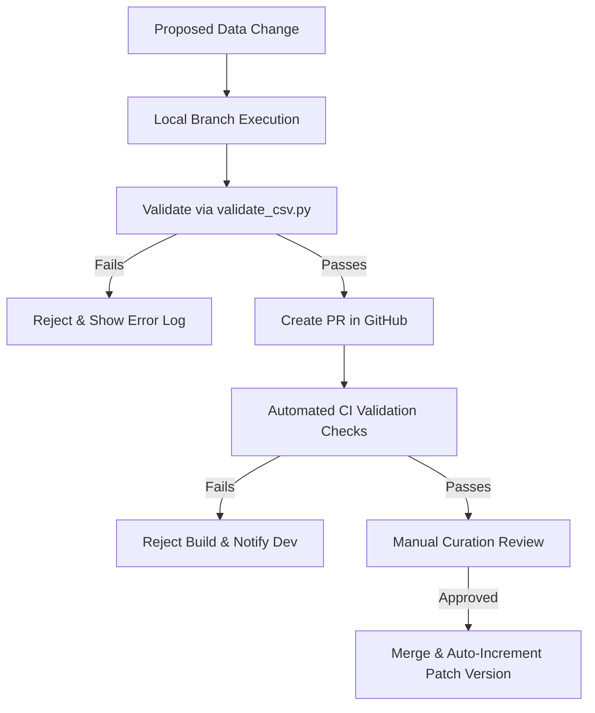

# QtyWise Master Dataset Specification

**Document Version:** 1.0.0-AP  
**Target Region:** Andhra Pradesh (Coastal Andhra, Rayalaseema, Uttarandhra)  
**Document Status:** Production-Ready Specification  
**Intended Audience:** Principal Architects, Database Designers, Systems Integrators, QA Leads, Data Curators  

---

## 1. Architectural Foundations & Design Choices

The QtyWise application operates as a client-side decision support system. To ensure sub-second response times on low-bandwidth mobile devices and robust offline performance, the master dataset must serve as the single source of truth. Every database schema, validation script, and UI widget relies on the fields defined below.

### 1.1 Native Metric Representation (Grams as Integer)
A critical architectural decision is storing all physical weights as **integers in grams (`g`)** rather than floating-point kilograms (`kg`). 
*   **Rationalization**: JavaScript engines represent numbers as IEEE 754 double-precision floats. Performing arithmetic on fractional weights (e.g., $0.1\text{kg} + 0.2\text{kg}$) introduces precision issues (e.g., `0.30000000000000004`). By using integer values of grams at the database level, the application avoids rounding errors.
*   **UI Resolution**: The client interface translates grams to kilograms for display when weight is $\ge 1000\text{g}$ (e.g., `1500g` is rendered as `1.5 kg`).

### 1.2 Discrete Quantization Mapping
Certain food categories (such as Eggs or Coconuts) are bought and consumed in discrete units rather than weight. However, standardizing the recommendation engine requires a uniform mathematical core. 
*   **Rationalization**: The specification defines `discrete_unit_weight_g` and `display_in_units`. This allows the calculation engine to calculate in grams (preserving scaling calculations) and convert to unit counts only at the display boundary.

---

## 2. Master Dataset Schema & Data Dictionary

This section defines the core fields for every food item record in the system.

### 2.1 Complete Data Dictionary

The following reference matrix outlines constraints, nullability, and database properties for all fields:

| Field ID | Technical Identifier | Logical Type | Nullability | Ingestion & Validation Rules | Example Value |
| :--- | :--- | :--- | :--- | :--- | :--- |
| **01** | `item_id` | String | **NOT NULL** | Match regex `^QTY-AP-[A-Z]{3}-[0-9]{4}$`. Must be unique. | `QTY-AP-VEG-0001` |
| **02** | `english_name` | String | **NOT NULL** | Title case, unique, alphabetic characters + spaces + parentheses. Max 50. | `Brinjal (Local)` |
| **03** | `telugu_name` | String | **NOT NULL** | Telugu Unicode characters block (`U+0C00` to `U+0C7F`). Unique. Max 100. | `వంకాయ` |
| **04** | `telugu_synonyms` | JSON Array | **NOT NULL** | Array of unique Telugu Unicode strings. Empty array `[]` allowed. Max 10. | `["వంకాయ", "అనపకాయ"]` |
| **05** | `category_code` | Enum (String) | **NOT NULL** | Values: `VEG`, `LVE`, `RVE`, `MEA`, `FIS`, `SAF`, `EGG`, `HRB`. | `VEG` |
| **06** | `sub_category_code` | String | **NOT NULL** | 3-letter capital alphabetic code mapped to `categories.json` registry. | `SOL` |
| **07** | `base_consumption_g_pp_pd`| Integer | **NOT NULL** | Range: `1` to `5000`. Base portion size per person per day. | `100` |
| **08** | `edible_yield_ratio` | Decimal | **NOT NULL** | Decimal between `0.01` and `1.00`. Represents portion edible after prep. | `0.85` |
| **09** | `min_purchase_qty_g` | Integer | **NOT NULL** | Range: `1` to `50000`. Must be $\ge$ `purchase_increment_g`. | `250` |
| **10** | `purchase_increment_g` | Integer | **NOT NULL** | Range: `1` to `10000`. Standard weight increment at retail. | `50` |
| **11** | `discrete_unit_weight_g` | Integer | *Nullable* | Integer between `1` and `10000`. Mandatory if `display_in_units` is `true`. | `55` |
| **12** | `display_in_units` | Boolean | **NOT NULL** | Logical `true` or `false`. | `false` |
| **13** | `recommended_storage_type`| Enum (String) | **NOT NULL** | Values: `AMBIENT_DRY`, `AMBIENT_VENTILATED`, `REFRIGERATED`, `FROZEN`. | `AMBIENT_VENTILATED` |
| **14** | `storage_rules` | JSON Object | **NOT NULL** | JSON structure declaring shelf-life limits under various storage types. | *See Section 2.2.14* |
| **15** | `seasonality_rules` | JSON Object | **NOT NULL** | Multiplier values for months `1` to `12`. Values between `0.00` and `3.00`.| *See Section 2.2.15* |
| **16** | `popularity_score` | Integer | **NOT NULL** | Range: `1` to `10`. Search weighting multiplier. | `9` |
| **17** | `priority_class` | Integer | **NOT NULL** | Range: `1` to `3` (1: Staple, 2: Regular, 3: Optional/Seasoning). | `1` |
| **18** | `selection_criteria_en` | String | **NOT NULL** | Plain text guidelines for inspection. Max 250 characters. | `Firm, glossy skin.` |
| **19** | `selection_criteria_te` | String | **NOT NULL** | Telugu Unicode guidelines for inspection. Max 300 characters. | `గట్టిగా ఉన్నవి.` |
| **20** | `common_dishes_en` | JSON Array | **NOT NULL** | Array of string names. Maximum 5 entries. | `["Vankaya Fry"]` |
| **21** | `common_dishes_te` | JSON Array | **NOT NULL** | Array of Telugu Unicode string names. Maximum 5 entries. | `["వంకాయ వేపుడు"]` |
| **22** | `regional_multipliers` | JSON Object | **NOT NULL** | Keys: regional codes. Values: multipliers between `0.10` and `2.50`. | *See Section 8.2* |
| **23** | `extension_attributes` | JSON Object | **NOT NULL** | Dynamic schema-less sandbox. Empty object `{}` if unused. | `{"spicy": true}` |

---

### 2.2 In-Depth Field Specifications & Architectural Justifications

#### FLD-01: Item ID (`item_id`)
*   **Purpose**: Immutable database primary key.
*   **Business Importance**: Provides a persistent reference for tracking customer purchase histories, cache entries, and mapping local synonyms to singular records.
*   **Validation Logic**: Regular expression check `^QTY-AP-[A-Z]{3}-[0-9]{4}$`.
*   **Usage in Engine**: Used as the identifier when compiling selected items and calculating shopping list state variables client-side.
*   **Future Scalability**: When scaling to other states (e.g., Karnataka), the state code token changes (e.g. `QTY-KA-VEG-0001`), preserving indexing patterns.

#### FLD-02: English Name (`english_name`)
*   **Purpose**: Reference label for the default English locale.
*   **Business Importance**: Allows administrative lookups and serves as a fallback search term.
*   **Validation Logic**: Title Case. Must start with a letter and contain only alphanumeric characters, spaces, and round brackets.
*   **Usage in Engine**: Direct lexicographical sorting and primary English-language search index matching.
*   **Future Scalability**: Variety classifications are maintained in parentheses, preventing name fragmentation (e.g., `Brinjal (Local)` vs `Brinjal (Bharta)`).

#### FLD-03: Telugu Name (`telugu_name`)
*   **Purpose**: Vernacular label for regional Telugu locale interface.
*   **Business Importance**: Essential for regional usability; users at Rythu Bazaars identify produce primarily via regional Telugu names.
*   **Validation Logic**: Enforced Telugu Unicode Block range (`\u0C00-\u0C7F`). Max length 100 characters.
*   **Usage in Engine**: Direct matching for Telugu search queries.
*   **Future Scalability**: If other languages are added (e.g., Tamil), translation lists hook into the `item_id` without renaming columns.

#### FLD-04: Telugu Synonyms (`telugu_synonyms`)
*   **Purpose**: Localized vocabulary mapping to support dialect differences.
*   **Business Importance**: Resolves regional terms across Andhra Pradesh (e.g., `Anapakaya` vs `Sorakaya` for Bottle Gourd).
*   **Validation Logic**: Valid JSON array of Telugu Unicode strings.
*   **Usage in Engine**: The search index expands search vectors dynamically. A user typing `Sorakaya` or `Anapakaya` matches the same item ID.
*   **Future Scalability**: Additional alias arrays can be registered for other states (e.g., `kannada_synonyms`).

#### FLD-05: Category Code (`category_code`)
*   **Purpose**: Master taxonomy classification.
*   **Business Importance**: Supports category navigation tabs and diet-based filtering (e.g., vegetarian users can filter out `MEA`, `FIS`, `SAF`).
*   **Validation Logic**: Value must match one of the defined 3-letter codes: `VEG`, `LVE`, `RVE`, `MEA`, `FIS`, `SAF`, `EGG`, `HRB`.
*   **Usage in Engine**: Filters candidate arrays before running recommendation iterations.
*   **Future Scalability**: New categories (e.g. `DAI` for Dairy) can be registered in the engine logic.

#### FLD-06: Sub-Category Code (`sub_category_code`)
*   **Purpose**: Fine-grained biological or culinary grouping.
*   **Business Importance**: Groups items in UI checklists (e.g. grouping `Tubers` together under Root Vegetables).
*   **Validation Logic**: 3-letter uppercase alphabetic code matching a key in `categories.json`.
*   **Usage in Engine**: Logic-driven clustering in output layouts.
*   **Future Scalability**: Subcategories can be added to the registry configuration without database column alterations.

#### FLD-07: Base Daily Consumption per Person (`base_consumption_g_pp_pd`)
*   **Purpose**: Baseline portion metric. The raw food weight consumed by one adult in one day.
*   **Business Importance**: The mathematical core of QtyWise. Serves as the starting coefficient before applying demographic scaling.
*   **Validation Logic**: Integer between `1` and `5000`.
*   **Usage in Engine**: Primary calculation coefficient:
    $$\text{Edible Portion Weight (g)} = P \times D \times \text{base\_consumption\_g\_pp\_pd}$$
    Where $P$ is the number of people and $D$ is the duration in days.
*   **Future Scalability**: Multipliers can scale this value for children, active sports profiles, or elderly groups.

#### FLD-08: Edible Yield Ratio (`edible_yield_ratio`)
*   **Purpose**: Compensate for prep loss (bones, skin, seed discard).
*   **Business Importance**: Raw purchased weight differs from consumed weight. Okra yield is high (`0.95`), while mutton yield is lower (`0.80`) due to bone weight. This field prevents purchasing shortages.
*   **Validation Logic**: Decimal value between `0.01` and `1.00` (up to 2 decimal places).
*   **Usage in Engine**:
    $$\text{Gross Weight (g)} = \frac{\text{Edible Portion Weight (g)}}{\text{edible\_yield\_ratio}}$$
*   **Future Scalability**: Multipliers can adjust this ratio for boneless cuts vs bone-in cuts.

#### FLD-09: Minimum Purchase Quantity (`min_purchase_qty_g`)
*   **Purpose**: Set the minimum transaction threshold.
*   **Business Importance**: Vendors at local markets do not weigh 10g of chillies. They sell in standardized packets or increments (usually starting at 100g or 250g).
*   **Validation Logic**: Integer. Must be $\ge$ `purchase_increment_g`.
*   **Usage in Engine**: If the calculated gross weight is less than `min_purchase_qty_g`, the engine defaults the recommendation to `min_purchase_qty_g`.
*   **Future Scalability**: Custom thresholds can be set for wholesale shopping modes.

#### FLD-10: Purchase Increment (`purchase_increment_g`)
*   **Purpose**: Set weight step increments matching scales.
*   **Business Importance**: Standardizes recommendations to match market measurements (e.g. rounding to the nearest 50g or 100g).
*   **Validation Logic**: Integer. Must divide the standard bounds.
*   **Usage in Engine**: Rounds recommendations above the minimum threshold:
    $$\text{Final Recommended Weight (g)} = \text{min\_purchase\_qty\_g} + \left( \left\lceil \frac{\text{Calculated Gross} - \text{min\_purchase\_qty\_g}}{\text{purchase\_increment\_g}} \right\rceil \times \text{purchase\_increment\_g} \right)$$
*   **Future Scalability**: Increments can adjust if users transition between supermarkets (smaller increments) and wholesale markets (larger increments).

#### FLD-11: Discrete Unit Weight (`discrete_unit_weight_g`)
*   **Purpose**: Weight equivalent of a single discrete item.
*   **Business Importance**: Integrates count-based items (e.g. Eggs) into the weight-based schema.
*   **Validation Logic**: Nullable integer. If `display_in_units` is `true`, this field must not be null.
*   **Usage in Engine**: Converts calculated gross weights into discrete counts:
    $$\text{Recommended Count} = \left\lceil \frac{\text{Calculated Gross (g)}}{\text{discrete\_unit\_weight\_g}} \right\rceil$$
*   **Future Scalability**: Handles packages, bakery products, and canned goods in future iterations.

#### FLD-12: Display in Units Flag (`display_in_units`)
*   **Purpose**: UI output directive.
*   **Business Importance**: Renders counts rather than weights in the final shopping list (e.g. showing "6 Eggs" instead of "330g of Eggs").
*   **Validation Logic**: Boolean.
*   **Usage in Engine**: Directs formatting output logic.
*   **Future Scalability**: Enables hybrid displays (e.g. showing both count and weight).

#### FLD-13: Recommended Storage Type (`recommended_storage_type`)
*   **Purpose**: Default preservation environment.
*   **Business Importance**: Guides user storage decisions at home.
*   **Validation Logic**: Enum string: `AMBIENT_DRY`, `AMBIENT_VENTILATED`, `REFRIGERATED`, `FROZEN`.
*   **Usage in Engine**: Used to warn users if their selected storage setup is insufficient.
*   **Future Scalability**: Integrates with smart home appliance integrations in the future.

#### FLD-14: Storage Rules (`storage_rules`)
*   **Purpose**: Declare shelf-life parameters under various storage types.
*   **Business Importance**: Flags warnings if a user attempts to buy items for a duration exceeding their shelf life under the selected storage condition.
*   **Validation Logic**: Structured JSON object with standard keys.
*   **Usage in Engine**:
    *   If `user_storage` matches a key, check `max_days`.
    *   If `duration` > `max_days`, trigger a UI warning (e.g., Gongura under `ambient` storage has a `max_days` of 1; planning a 3-day duration triggers a warning).
*   **Future Scalability**: Can store advanced climate coefficients (e.g., humidity tolerances) for commercial warehouses.

#### FLD-15: Seasonality Rules (`seasonality_rules`)
*   **Purpose**: Scale recommendations based on monthly agricultural yields.
*   **Business Importance**: Adjusts recommendations based on seasonal availability (e.g., lower availability of delicate greens during summer).
*   **Validation Logic**: JSON object mapping month strings `"1"` to `"12"` to decimal factors (`0.00` to `3.00`).
*   **Usage in Engine**: Scales base portion sizes:
    $$\text{Adjusted Base} = \text{base\_consumption\_g\_pp\_pd} \times \text{seasonality\_rules[current\_month]}$$
*   **Future Scalability**: Multipliers can update dynamically via market price feeds.

#### FLD-16: Popularity Score (`popularity_score`)
*   **Purpose**: Search relevance weighting.
*   **Business Importance**: Sorts staple items (like Onions or Tomatoes) to the top of search listings.
*   **Validation Logic**: Integer between 1 and 10.
*   **Usage in Engine**: Used to score and sort search results.
*   **Future Scalability**: Can update dynamically using telemetry data on user selections.

#### FLD-17: Priority Class (`priority_class`)
*   **Purpose**: Calculation priority.
*   **Business Importance**: Groups foods into Staples, Regulars, and Optionals.
*   **Validation Logic**: Integer: `1`, `2`, or `3`.
*   **Usage in Engine**: Groups items in calculation worksheets.
*   **Future Scalability**: Can be linked to budget optimization algorithms (e.g. prioritizing staples when budget is restricted).

#### FLD-18 & FLD-19: Selection Criteria (`selection_criteria_en` / `selection_criteria_te`)
*   **Purpose**: Quality control instructions.
*   **Business Importance**: Helps users inspect and select fresh items, reducing waste.
*   **Validation Logic**: Max 250 characters (EN) / 300 characters (TE).
*   **Usage in Engine**: Displayed on UI info cards.
*   **Future Scalability**: Text fields can reference image URLs or instructional videos.

#### FLD-20 & FLD-21: Common Dishes (`common_dishes_en` / `common_dishes_te`)
*   **Purpose**: Match items to typical regional dishes.
*   **Business Importance**: Contextualizes quantity recommendations by showing what dishes can be cooked with the recommended amount.
*   **Validation Logic**: JSON array of strings. Max 5 items.
*   **Usage in Engine**: Rendered on UI cards.
*   **Future Scalability**: Can map to specific recipe ingredient ratios in the future.

#### FLD-22: Regional Multipliers (`regional_multipliers`)
*   **Purpose**: Scale portions based on micro-regional consumption patterns.
*   **Business Importance**: Accounts for regional dietary patterns (e.g., higher seafood consumption in Coastal AP).
*   **Validation Logic**: JSON object mapping region codes to decimals (`0.10` to `2.50`).
*   **Usage in Engine**:
    $$\text{Adjusted Portion} = \text{base\_consumption} \times \text{regional\_multipliers[user\_region]}$$
*   **Future Scalability**: Enables scaling to other states (e.g., adding `TG_HYDERABAD`) without modifying the database schema.

#### FLD-23: Extension Attributes (`extension_attributes`)
*   **Purpose**: Dynamic JSON storage for category-specific variables.
*   **Business Importance**: Future-proofs the schema to support new categories (like dairy or packed foods) without requiring database migrations.
*   **Validation Logic**: Valid JSON object. Must pass schematic sub-validations if registered in the system metadata repository.
*   **Usage in Engine**: Stores specialized parameters (e.g. brand, allergen info, fat percentage) required by specific categories.
*   **Future Scalability**: Dynamic schema extension.

---

## 3. Data Representation & Naming Standards

To ensure database consistency and prevent collisions, QtyWise enforces strict naming and formatting standards.

### 3.1 Unique ID Format

Every item in the master dataset must possess a unique, immutable identifier matching the syntax:

$$\mathbf{QTY-AP-[CAT]-[SEQ]}$$

*   `QTY`: Standard application prefix (static).
*   `AP`: State localization code (e.g., `AP` for Andhra Pradesh, `TG` for Telangana, `TN` for Tamil Nadu).
*   `[CAT]`: 3-letter category contraction. Valid category codes are:
    *   `VEG` (Vegetables)
    *   `LVE` (Leafy Vegetables)
    *   `RVE` (Root Vegetables)
    *   `MEA` (Meat)
    *   `FIS` (Fish)
    *   `SAF` (Seafood)
    *   `EGG` (Eggs)
    *   `HRB` (Herbs)
*   `[SEQ]`: 4-digit zero-padded sequence number starting at `0001` (e.g., `0001`, `0002`).

*Example ID*: `QTY-AP-LVE-0012` represents the 12th leafy vegetable item registered in Andhra Pradesh.

### 3.2 Category and Sub-Category Codes

Categories are represented by a 3-letter capital identifier. The mapping is maintained in `categories.json`.

```json
{
  "VEG": { "name": "Vegetables", "sub_categories": { "SOL": "Solanaceous", "CUC": "Cucurbits", "LEG": "Legumes" } },
  "LVE": { "name": "Leafy Vegetables", "sub_categories": { "ACD": "Acidic Greens", "NEU": "Neutral Greens" } },
  "RVE": { "name": "Root Vegetables", "sub_categories": { "TUB": "Tubers", "BLB": "Bulbs" } },
  "MEA": { "name": "Meat", "sub_categories": { "POL": "Poultry", "RED": "Red Meat" } },
  "FIS": { "name": "Fish", "sub_categories": { "FRW": "Freshwater", "MAR": "Marine" } },
  "SAF": { "name": "Seafood", "sub_categories": { "SHL": "Shellfish" } },
  "EGG": { "name": "Eggs", "sub_categories": { "AVI": "Avian Eggs" } },
  "HRB": { "name": "Herbs", "sub_categories": { "CUL": "Culinary Herbs" } }
}
```

### 3.3 Text Naming Conventions

*   **English Names**:
    *   Must be Title Case.
    *   No trailing or leading whitespaces.
    *   No double spaces.
    *   Common variety designations must be appended in parentheses: `Brinjal (Local)`, `Brinjal (Long)`.
*   **Telugu Names**:
    *   Must use modern Telugu script. Sanskritized translations should be avoided in favor of local names (e.g. write `బెండకాయ` instead of `భిండి`).
    *   Must be written in standard UTF-8 Telugu characters. No Latin text or English phonetic transliterations.

### 3.4 Measurement Units Standard

To maintain integrity and eliminate calculation errors, QtyWise enforces:
*   **Unit Restriction**: All weights must use **grams (`g`)** or **kilograms (`kg`)** as system standards.
*   **Database Native Metric**: Inside the database, all quantities, minimum purchase amounts, and increments are stored in **grams (`g`)** as integer values. This eliminates floating-point rounding errors (e.g., storing `250` instead of `0.25`).
*   **Engine UI Resolution**: The recommendation engine outputs `kg` for display if the calculated weight is $\ge 1000\text{g}$, and `g` if it is $< 1000\text{g}$ (e.g. `750g` of Okra, `1.5kg` of Onion).

### 3.5 Storage Type Representations

All storage preferences must match the following uppercase enum literals:
*   `AMBIENT_DRY`: Open baskets, dry pantry shelf (e.g., Onions, Garlic).
*   `AMBIENT_VENTILATED`: Perforated trays, dry ventilated area (e.g., Potatoes, Ginger).
*   `REFRIGERATED`: Standard crisper drawer or main fridge cabinet ($4^{\circ}\text{C}$ to $8^{\circ}\text{C}$) (e.g., Greens, Okra, Coriander).
*   `FROZEN`: Deep freeze compartment ($-18^{\circ}\text{C}$ or lower) (e.g., Meats, Seafood).

### 3.6 Shelf Life Representation

Shelf life is represented in the JSON payload as a map of storage types to performance metrics:

```json
"storage_rules": {
  "ambient": {
    "max_days": 3,
    "decay_factor": 0.15
  },
  "refrigerated": {
    "max_days": 7,
    "decay_factor": 0.05
  },
  "frozen": {
    "max_days": null,
    "decay_factor": null
  }
}
```
*Note: A `null` value indicates that storage under that condition is not recommended or is unsafe.*

### 3.7 Recommendation Value Standards

*   All portions are defined on a **per-person, per-day** basis to allow linear scaling.
*   Portions must not contain fractions smaller than $1\text{g}$ (integers only).
*   Minimum recommendation returned by the engine is bounded by `min_purchase_qty_g`.

### 3.8 Sorting, Searching, and Filtering Standards

To provide a fast mobile experience, data is optimized for the following operations:
*   **Sorting**:
    *   *Default*: Sort by `popularity_score` (Descending) first, then by `calculation_priority` (Ascending), then by `english_name` (Ascending).
    *   *Alternative*: Sort by `english_name` / `telugu_name` alphabetically.
*   **Searching**:
    *   Search terms must be stripped of punctuation, converted to lowercase, and trimmed.
    *   Match against: `english_name` (case-insensitive), `telugu_name` (direct match), and `telugu_synonyms` array elements.
*   **Filtering**:
    *   Filter by `category_code` (strict match).
    *   Filter by `recommended_storage_type` (strict match).

---

## 4. Ingestion & Validation Standards

To maintain dataset integrity, the data ingestion pipeline enforces the following validation checks. Any data commit failing a single validation rule is rejected.

### 4.1 Duplicate Prevention Rules

1.  **ID Uniqueness**: The primary key `item_id` must be unique across the entire database.
2.  **String Collision Detection**: To prevent duplicate items registered under minor variations, names are validated using a normalized format:
    $$\text{Normalize}(Name) = \text{lower}(\text{replace}(Name, \text{" "}, \text{""}))$$
    The normalized value of `english_name` and `telugu_name` must be unique across all records (e.g. `Green Chillies` and `GreenChillies` will trigger a duplicate error).

### 4.2 Unit Consistency Rules

*   If `display_in_units` is set to `false`, then `discrete_unit_weight_g` must be `null` or omitted.
*   If `display_in_units` is set to `true`, then `discrete_unit_weight_g` must be present and must be an integer $\ge 1$.
*   `min_purchase_qty_g` must be a multiple of `purchase_increment_g` to prevent rounding errors during calculations.
    $$\text{min\_purchase\_qty\_g} \pmod{\text{purchase\_increment\_g}} = 0$$

### 4.3 Mandatory Fields Check

Every record must possess values for the fields flagged as **Required** in the Data Dictionary. No `null` values are allowed in required fields. Empty strings `""` or empty JSON arrays `[]` are classified as invalid.

### 4.4 Boundary Value Assertions

The following mathematical constraints are checked for every item record:

$$\text{min\_purchase\_qty\_g} \le \text{base\_consumption\_g\_pp\_pd} \times 7$$
*(Ensures the minimum purchase increment is not higher than a typical individual's weekly consumption).*

$$0.01 \le \text{edible\_yield\_ratio} \le 1.00$$

$$1 \le \text{popularity\_score} \le 10$$

$$1 \le \text{priority\_class} \le 3$$

---

## 5. Dataset Folder Structure

To manage schema files, source documentation, master CSV records, validation tools, and translation packages in a GitHub repository, the database sub-folder must implement this layout:

```
database/
├── schemas/
│   ├── postgres_master_schema.sql      # PostgreSQL DDL table script
│   └── validation_schema.json          # JSON Schema validating config files
├── master_data/
│   ├── categories.json                 # Category & subcategory lookup registry
│   └── ap_master_dataset_v1.0.csv      # Production Master CSV file
├── translations/
│   ├── app_ui_te.json                  # Vernacular translations dictionary
│   └── app_ui_en.json                  # English translations dictionary
├── scripts/
│   ├── validate_csv.py                 # Core Python verification engine
│   └── generate_client_bundle.py       # Compiles CSV/JSON into single JSON bundle
└── migrations/
    └── 0001_initial_schema.sql         # SQL migration scripts
```

---

## 6. Dataset Versioning Strategy

Data changes impact recommendation logic. Thus, the master dataset must be versioned separately from application code using a customized **Semantic Data Versioning** framework (`vD.M.P`):

### 6.1 Version Format: `v[DATA_MODEL].[MAJOR].[PATCH]`

*   `DATA_MODEL` (D): Incremented when the **structural schema changes** (e.g. adding a new field like `calorie_count` or removing `priority_class`). Requires system database migrations.
*   `MAJOR` (M): Incremented when **items are added, deleted, or calculation coefficients are significantly modified** (e.g. increasing `base_consumption_g_pp_pd` for Meats across the board).
*   `PATCH` (P): Incremented for **typographical fixes, translations, and cosmetic edits** that do not affect the output of the recommendation engine.

### 6.2 Change Log Standards

Every dataset update must document changes in the `docs/master-data/changelog.md` file using the keep-a-changelog format:

```markdown
## [v1.2.0] - 2026-07-17
### Added
- Added `QTY-AP-SAF-0008` (Prawns (Medium) / రొయ్యలు) to Seafood category.
### Changed
- Increased `base_consumption_g_pp_pd` for `QTY-AP-LVE-0002` (Gongura) from 250g to 300g to align with new NIN AP standards.
### Fixed
- Fixed typo in Telugu spelling of Taro Root (`చామదుంప` from `చామదుంపలు`).
```

---

## 7. Maintenance Guidelines

To maintain data quality and prevent drift, the following data lifecycle rules must be followed:

### 7.1 Data Ownership Roles

*   **Data Curation Lead**: Responsible for reviewing food science metrics (base consumption rates, yield factors, shelf lives) and signing off on master changes.
*   **Localization Specialist**: Verifies Telugu Unicode spelling, regional vocabulary differences, and common dishes.
*   **DevOps Engineer**: Integrates compilation scripts into CI/CD pipelines to validate modifications automatically on git pull requests.

### 7.2 Data Audit Workflow



### 7.3 Seasonal Review Cadence

The dataset must be reviewed **quarterly** to align recommendations with harvest seasons and local supply conditions:
*   *January (Winter peak)*: Calibrate root vegetables and winter greens coefficients.
*   *April (Summer peak)*: Review shelf lives of greens under ambient temperature parameters (summer heat increases decay rates).
*   *July (Monsoon peak)*: Adjust fish/seafood availability flags (marine breeding restrictions).
*   *October (Post-monsoon)*: Adjust yields and quality criteria for newly harvested crops.

---

## 8. Future Expansion Strategy

QtyWise is designed to scale horizontally to new geographical territories and vertically to new food categories without altering the database schema:

```
QtyWise Scalable Core
   ├── extension_attributes JSONB (Vertical Category Scaling)
   │     ├── Fruits  --> { sugar_content, pit_type }
   │     ├── Dairy   --> { fat_percentage, pasteurization }
   │     └── Spices  --> { dry_form, heat_rating }
   │
   └── regional_multipliers JSONB (Horizontal Regional Scaling)
         ├── TG-HYD  --> { meat_factor: 1.2 }
         ├── KA-BLR  --> { veg_factor: 1.1 }
         └── TN-CHE  --> { seafood_factor: 1.3 }
```

### 8.1 Vertical Expansion: Fruits, Dairy, Spices, Packed Foods

By utilizing the schema's `extension_attributes` JSON field, teams can add category-specific properties without modifying columns:

*   **Dairy**: Add `fat_percentage`, `volume_ml`, and measure in grams (convert from volume using density factor, e.g. 1030g for 1 Liter of milk).
*   **Spices**: Add `spice_heat_index` (Scoville scale), `form` (whole/ground).
*   **Packed Foods**: Add `brand_name`, `pack_size_g`, `preservative_flags`, `bar_code_id`.
*   **Fruits**: Add `ripening_rate_days`, `peel_type` (edible vs. non-edible).

*Example JSON for Dairy (Milk)*:
```json
{
  "item_id": "QTY-AP-DAI-0201",
  "english_name": "Whole Milk",
  "extension_attributes": {
    "fat_percentage": 3.5,
    "volume_ml": 1000,
    "is_homogenized": true
  }
}
```

### 8.2 Horizontal Expansion: Multi-Regional Recommendation Profiles

The `regional_multipliers` JSON field maps localized consumer behavior adjustments:
*   If QtyWise launches in Telangana, we append regional keys directly inside the JSON:
    ```json
    "regional_multipliers": {
      "AP_RAYALASEEMA": 1.15,
      "TG_HYDERABAD": 1.35,
      "KA_BANGALORE": 0.90
    }
    ```
The recommendation engine applies this multiplier automatically depending on the user's localized workspace settings, preventing the need to clone item records for different regions.

---

## 9. Best Practices

1.  **No Server-Side Calculations**: Ensure the schema fits in client-side memory. Compiling the dataset into a single JSON bundle allows offline calculation on mobile devices.
2.  **Integer Math over Floats**: Store baseline quantities in grams (`g`) to prevent decimal formatting discrepancies in javascript engines.
3.  **Strict Vernacular Verification**: Do not rely on automated machine translations (like Google Translate) for the `telugu_name` and `telugu_synonyms` fields. They must be validated by native Telugu speakers to match bazaar terminology.
4.  **Conservative Ambient Storage Bounds**: Under-estimate ambient shelf-life in the database rules to prevent food poisoning alerts. Tropical summer temperatures accelerate spoilage.
5.  **Audit Logs Integrity**: Never edit database entries directly in production. All corrections must go through git version controls.

---

## 10. Final Architectural Summary

The QtyWise Master Dataset Structure achieves standard database stability and cross-category scalability. By structuring data around a weight-based model (grams) and using JSON blocks for complex properties (`storage_rules`, `seasonality_rules`, `regional_multipliers`, and `extension_attributes`), the system remains robust. 

This model supports the immediate collection of V1 data (vegetables, meats, eggs, fish, herbs) in Andhra Pradesh, while allowing future updates to fruits, groceries, dairy, and other Indian states without requiring schema updates or database migrations. Developers and researchers can use this blueprint to populate data directories and configure ingestion checks.
